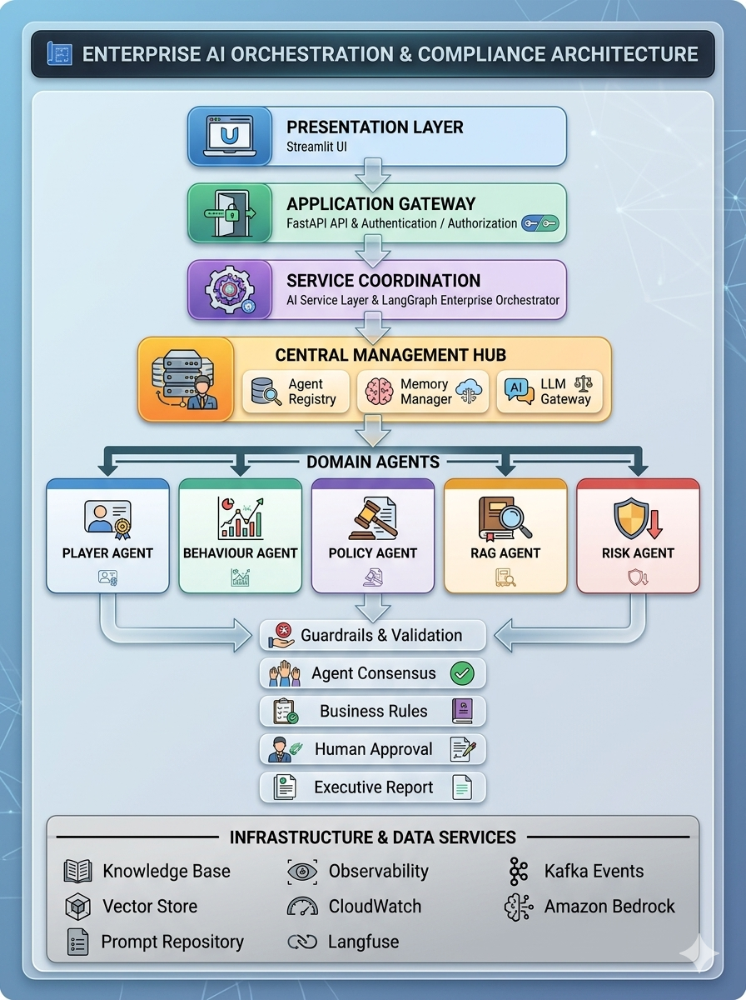

# 🎮 Gaming AI Nexus

Enterprise Multi-Agent AI Orchestrator built using

- Amazon Bedrock
- AWS Bedrock Runtime
- Multi-Agent Architecture
- Python
- Enterprise Design Patterns

This project demonstrates how multiple AI agents collaborate to solve complex gaming and enterprise business problems using Amazon Bedrock.

## 📌 Project Overview

Gaming AI Nexus is an enterprise-grade AI orchestration platform demonstrating how multiple specialized AI agents collaborate through an orchestrator.

Unlike a single LLM application, each agent owns one responsibility and communicates through a central orchestration layer.

The project follows enterprise architecture principles including:

- Loose coupling
- Separation of concerns
- Extensible agent framework
- Enterprise logging
- Configuration management
- AWS Bedrock integration
- Future support for memory, tools, and autonomous workflows

## 🏗️ Architecture




## 📂 Project Structure

```
gaming-ai-nexus
│
├── app.py
├── config/
├── docs/
├── logs/
├── src/
│   ├── agents/
│   ├── bedrock/
│   ├── orchestrator/
│   ├── utils/
│   └── services/
│
├── tests/
├── requirements.txt
└── README.md
```